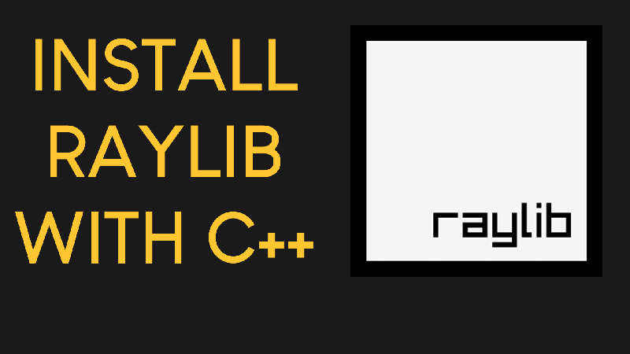

# BuildComputer

Aplicação interativa desenvolvida em C++ com Raylib para ensinar e explicitar o processo de montagem de um computador.

## Conteúdo
* **Guia Passo a Passo** - Explicações detalhadas sobre cada componente e a sua instalação
* **Componentes Interativos** - Identificação de peças (Processador, Motherboard, RAM, GPU, etc.)
* **Simulador de Montagem** - Visualização e prática do processo de construção do PC

## Como Executar
1. **Abrir no VS Code**:
   * Abre o ficheiro `main.code-workspace` no Visual Studio Code.
2. **Compilar e Executar**:
   * Pressiona `F5` para compilar e iniciar o programa.

## Objetivo
Criar uma ferramenta educativa e intuitiva que simplifique a aprendizagem sobre hardware e montagem de computadores.

---

# Raylib-CPP-Starter-Template-for-VSCODE-V2
Raylib C++ Starter Template for Visual Studio Code on Windows.
This demo project contains a bouncing ball raylib example program.
It works with raylib version 5.0. Tested on both Windows 10 and Windows 11.

# How to use this template
1. Double click on the main.code-workspace file. This will open the template in VS Code.
2. From the Explorer Window of VS Code navigate to the src folder and double click on the main.cpp file.
3. Press F5 on the keyboard to compile and run the program.

# What's changed
The template now uses folders for better organizion of the files. So, all the source code now lives in the src folder.

# Video Tutorial

  

🎥 <a href="https://www.youtube.com/watch?v=PaAcVk5jUd8">Video Tutorial on YouTube</a>

